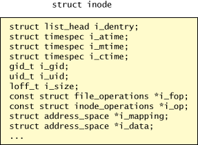
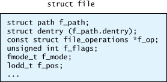

# Hệ thống file ảo (VFS)

*VFS (Virtual File System - Hệ thống File ảo)* là một bộ phân của nhân Linux.
VFS đóng vai trò làm giao diện giữa các *system call* liên quan đến thao tác
file (một phần của System call interface - SCI) và các hệ thống file cụ thể.

Các hệ thống file cần cung cấp các thao tác với giao diện được VFS quy định,
VFS sẻ sử dụng các thao tác đó để cài đặt các system call như `open`, `read`,
`write`, ... Như vậy VFS coi các hệ thống file là bình đẳng như nhau, không
cần quan tâm để cài đặt cụ thể bên trong mỗi hệ thống file là như thế nào.

Nhờ có VFS mà các hệ thống file mới được cài đặt cho Linux rất dễ dàng. Hiện
nay Linux là hệ điều hành hỗ trợ nhiều hệ thống file nhất.

-----------------------------------------------------------------

## Cấu trúc của VFS
### Mô hình file chung (common file model)
VFS quy định một **mô hình chung** cho các hệ thống file. Mô hình này giống với
mô hình của các hệ thống file dành cho Linux. Như vậy các hệ thống file cho
Linux sẽ có hiệu năng cao hơn các hệ thống file không dành cho Linux (như FAT,
NTFS) khi chạy trên VFS bởi vì sẽ tốn nhiều chi phí để *ánh xạ* lên mô hình chung quy định bởi VFS.

Mô hình chung này được tổ chức theo kiểu *hướng đối tượng*, trong đó các *đối
tượng* bao gồm *cấu trúc dữ liệu* và các *phương thức* thao tác trên nó. Mỗi
hệ thống file khác nhau sẽ cài đặt các *phương thức* theo các cách khác nhau. Giống như trong lập 
trình hướng đối tượng, các lớp con sẽ cài đặt các phương ảo (virtual method)
của lớp cha. Vì Linux kernel được viết bởi C là một ngôn ngữ không hỗ trợ khái
niệm *lớp* nên các đối tượng trong VFS được cài đặt là các thể hiện của một
*struct*, các phương thức ảo được cài đặt là các *con trỏ hàm* thành phần của
*struct* đó.

Có bốn loại đối tượng trong mô hình: *superblock*, *inode*, *file*, *dentry*.

#### superblock
*superblock* của một hệ thống file chứa các thông tin về hệ thống file đó,
*superblock* là một cấu trúc dữ liệu tồn tại (nhiều nơi) trên đĩa và trong bộ
nhớ. Những thông tin chứa trong *superblock* bao gồm số block của hệ thống
file, số block trống, thư mục gốc, ...

Trong bộ nhớ, mỗi hệ thống file được *mount* sẽ có một *superblock* tương ứng.
Tất cả các *superblock* được lưu dưới dạng một danh sách liên kết đôi.

Mỗi *superblock* trong bộ nhớ là một đối tượng thuộc kiểu *super_block* trong
danh sách liên kết. Trong cấu trúc này, *s_list* trỏ về dầu danh sách. *s_op*
là con trỏ kiểu *struct super_operations*, là một cấu trúc chứa các con trỏ hàm
cho các thao tác của *superblock*. Mỗi *superblock* của một kiểu hệ thống file
khác nhau sẽ có các thao tác khác nhau.

#### inode
Trên nhiều hệ thống file dành cho Linux như *ext/2/3/4*, *xfs*, ... mỗi *đối
tượng (file, thư mục, symlink)* được mô tả bằng một *inode*. *inode* chứa các
thông tin về đối tượng đó như kích thước, vị trí trên đĩa, quyền truy nhập, ...

VFS cũng quy định một loại đối tượng `inode` có chứa những thông tin như inode
trên đĩa. Tương tự như `superblock`, đối tượng `inode` trong VFS cũng chứa con
trỏ hàm đến các thao tác trên inode, và mỗi hệ thống file khác nhau các thao
tác sẽ có cài đặt khác nhau. Kể cả những hệ thống file không có khái niệm
`inode`.

#### dentry (directory entry)
Cấu trúc phân cấp của hệ thống file được quản lý bằng đối tượng gọi là `dentry`
(hay `directory entry`). Mỗi hệ thồng file có một dentry *gốc* (`root dentry`),
là dentry duy nhất không có cha. Các `dentry` khác đều dẫn xuất từ `root`. Ví
dụ, với file có đường dẫn là `/home/user/name`, sẽ có 4 dentry được tạo ra là:
`root /`, `home/`, `user/`, `name`.

Đối tượng `dentry` trong VFS chứa thông tin về `superblock` của hệ thống file
chứa nó, địa chỉ của dentry cha (`parent`), danh sách các con (`children`),
tên của dentry, địa chỉ của đối tượng `inode` mà nó trỏ tới. Và giống như hai
loại đối tượng trên, cũng có một tập các thao tác trên dentry.

#### file
Trong VFS, `file` là đối tượng tương ứng với quan hệ giữa một **file trên đĩa** và **tiến trình** đang mở file đó.
Khi một **file trên đĩa** được mở bởi một **tiến trình**, một đối tượng `file`
được tạo ra. Đối tượng này chứa các thông tin như đường dẫn đến file trên đĩa,
dentry của đường dẫn đó, các cờ (`flag`) quy định các thao tác với file trên
đĩa, vị trí offset mà con trỏ file đang trỏ tới, ...

### Quan hệ giữa các đối tượng VFS

Mỗi hệ thống file chỉ có một đối tượng `superblock`, tất cả các đối tượng
`inode`, `dentry` đều chứa con trỏ trỏ tới `superblock` này.
Mỗi một đối tượng trên đĩa (`file`, `symlink`, `thư mục`) đều tương ứng với một
`inode` trên VFS. Nhưng một `inode` có thể tương ứng với nhiều `dentry` (tức
là nhiều `dentry` cùng trỏ đến một `inode`, lúc này một dentry đó được coi là
một `hardlink`).

Và mỗi một `tiến trình` khi mở `file` thông qua một một `dentry` thì tạo ra
tương ứng một đối tượng `(VFS) file`.

Hình trên cho thấy 3 `tiến trình` đang mở file trên đĩa. VFS sẽ tạo
ra 3 đối tượng `file` tương ứng. Trong đó có 2 tiến trình mở cùng một `dentry`,
tức là mở file ở cùng một đường dẫn, tiến trình còn lại mở file với đường dẫn
khác. Tuy nhiên cả hai `dentry` được sử dụng đều là `hardlink` của cùng một
file thật trên đĩa, chúng đều trỏ đến cùng một `inode`.

--------------------------------------------------------------

## Một số hệ thống file

